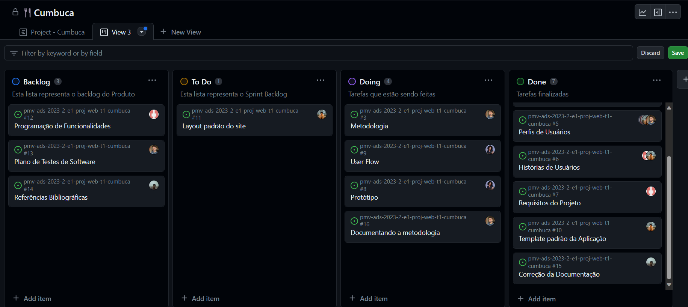
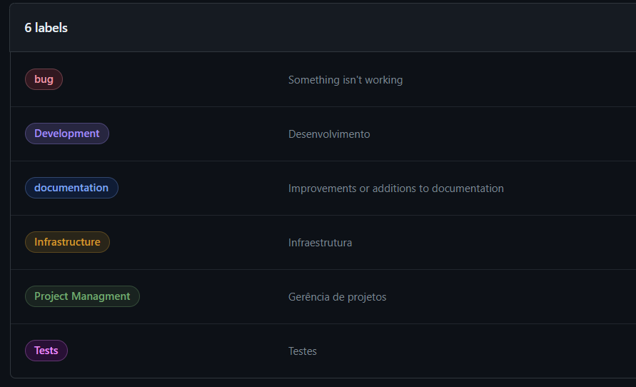
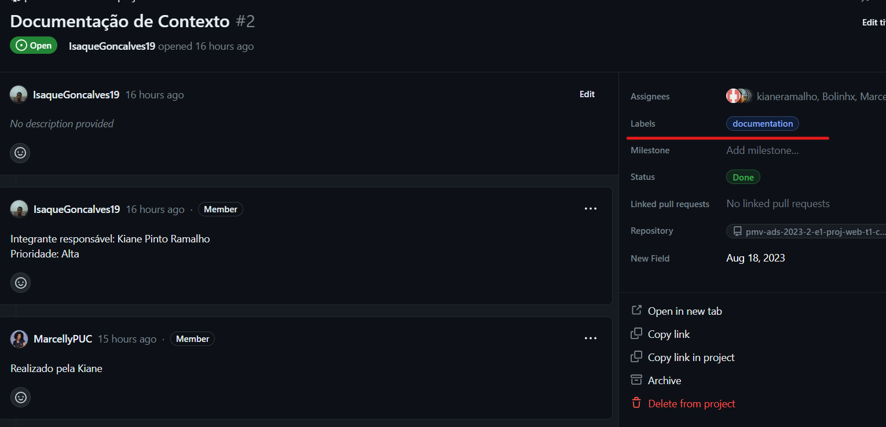

# Metodologia

A metodologia contempla os instrumentos usados para manter os recursos e outras necessidades organizacionais, garantindo a gestão adequada do tempo e a realização das atividades do projeto.

## Gerenciamento de Projeto

No contexto do nosso projeto, o grupo tomou a decisão estratégica de adotar a metodologia ágil para gerenciamento, com foco específico na implementação do Método Scrum. A escolha deliberada por essa abordagem foi fundamentada em uma série de razões, visando aprimorar a eficiência, a flexibilidade e a colaboração durante todo o ciclo de vida do projeto.

### Divisão de Papéis

- Scrum Master: Marcelly Giovanna de Souza e Maia
- Product Owner: Isaque Gonçalves Ferreira
- Equipe de Desenvolvimento: Adrian Sodré da Silva e Kiane Pinto Ramalho
- Equipe de Design: Bernardo Miguel Soutelo Marra

### Processo

No decorrer deste projeto, optamos por adotar a metodologia Kanban, uma abordagem ágil que prioriza a visualização e o gerenciamento do fluxo de trabalho. Integrado ao Kanban, escolhemos utilizar o GitHub Projects como nossa ferramenta central para listar e controlar todas as tarefas relacionadas ao projeto. Esta decisão estratégica foi fundamentada na necessidade de um sistema robusto que nos permitisse organizar e acompanhar o progresso das atividades de forma eficaz. A estrutura do nosso quadro Kanban no GitHub Projects foi dividida em quatro principais colunas:

- Backlog: é o ponto de entrada para todas as tarefas do projeto. Aqui, listamos todas as funcionalidades, melhorias e correções que precisam ser implementadas. Cada item no Backlog é detalhado e priorizado, garantindo que a equipe saiba quais são as próximas metas a serem atingidas.
- To Do: Quando uma tarefa é selecionada para execução, ela é movida para a coluna "To Do". Nesta fase, as atividades são claramente definidas, e os membros da equipe podem acessar as informações necessárias para iniciar o trabalho. Esta coluna representa a lista de tarefas imediatas que precisam ser realizadas. 
- Doing: nessa coluna as tarefas estão em andamento. Isso significa que os membros da equipe estão ativamente trabalhando nelas.
- Done: finalmente, quando uma tarefa é concluída, ela é movida para a coluna "Done". Aqui, a equipe revisa o trabalho realizado, assegurando que atende aos requisitos e padrões de qualidade estabelecidos. Uma vez validada, a tarefa é considerada oficialmente concluída.

Abaixo, uma imagem de como está o kanbam:

### Etiquetas

As tarefas são, ainda, etiquetadas em função da natureza da atividade e seguem o seguinte esquema de cores/categorias:

<ul>
  <li>Bug (Erro no código)</li>
  <li>Desenvolvimento (Development)</li>
  <li>Documentação (Documentation)</li>
  <li>Gerência de Projetos (Project Management)</li>
  <li>Infraestrutura (Infrastructure)</li>
  <li>Testes (Tests)</li>
</ul>

Visualização das etiquetas dentro de um item do Kanban

  
### Ferramentas

| AMBIENTE                            | PLATAFORMA                         | LINK DE ACESSO                         |
|-------------------------------------|------------------------------------|----------------------------------------|
| Repositório de código fonte         | GitHub                             | https://github.com/ICEI-PUC-Minas-PMV-ADS/pmv-ads-2023-2-e1-proj-web-t1-cumbuca/tree/main/codigo-fonte                            |
| Documentos do projeto               | GitHub                             | https://github.com/ICEI-PUC-Minas-PMV-ADS/pmv-ads-2023-2-e1-proj-web-t1-cumbuca/tree/main/documentos                            |
| Projeto de Interface                | Figma                              | https://www.figma.com/file/8J2L0t0wplQcSxAdsxL61c/Cumbuca?type=design&node-id=0-1&mode=design                            |
| Gerenciamento do Projeto            | GitHub Projects                    | https://github.com/orgs/ICEI-PUC-Minas-PMV-ADS/projects/677/views/3?layout=board                            |
| Hospedagem                          | GitHub Pages                       | http://....                            |
| Ambiente de reunião                  | Microsoft Teams                    | https://teams.microsoft.com/_#/school/conversations/Geral?threadId=19:pLyRhKHyovEgmDG62wd3Arqm7xVIG9etlWwFca5ifEM1@thread.tacv2&ctx=channel|

### Estratégia de Organização de Codificação 

Todos os artefatos relacionados a implementação e visualização dos conteúdos do projeto do site deverão ser inseridos na pasta [codigo-fonte](http://https://github.com/ICEI-PUC-Minas-PMV-ADS/WebApplicationProject-Template-v2/tree/main/codigo-fonte). Consulte também a nossa sugestão referente a estratégia de organização de codificação a ser adotada pela equipe de desenvolvimento do projeto.
